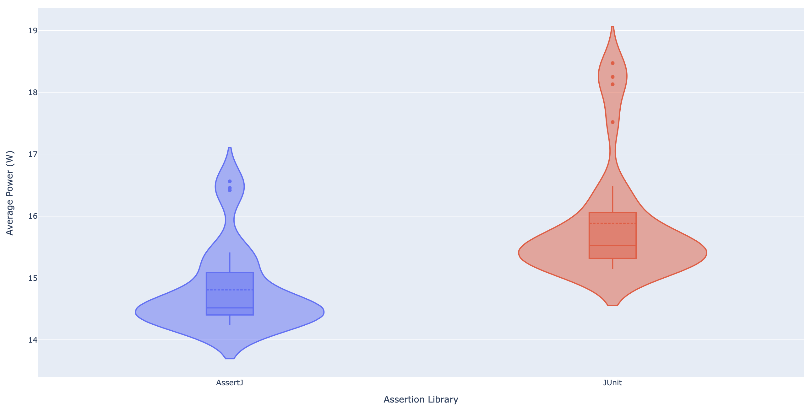
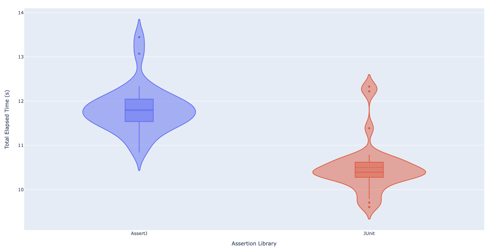
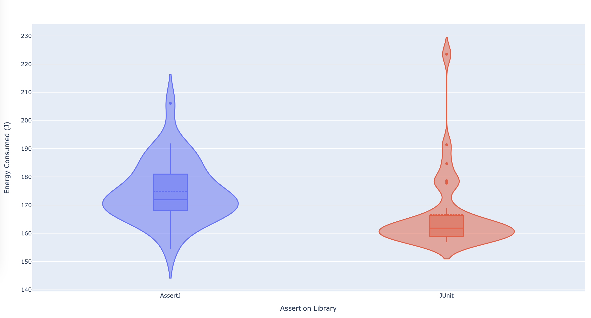

*by [Hana Jirovská](https://github.com/hjir) and [Sára Juhošová](https://github.com/sarajuhosova)*

AssertJ is a popular testing library which provides clearly defined assertions and arguably makes software testing a more enjoyable task. Is there, however, any cost to using AssertJ? In this article, we assess whether using this library brings any overhead in terms of the consumed energy and hence how sustainable AssertJ actually is.

As software slowly creeps into almost every aspect of our lives, looking at its ecological impact becomes more important everyday. According to an article on Harvard Business Review [1], “the way software is designed, developed, and deployed can have a major impact on energy consumption”. It is thus crucial that software developers start becoming aware of what environmental impact their products have and what they can do to make it better.

In this article, we focus on *electricity* - one of the eight principles of sustainable software engineering [2]. We will be exploring the energy-efficiency of AssertJ, a popular testing library used in many Java test suites. While not part of the production code, the assertions that AssertJ provides are run a significant amount of times during the development process of these applications and are thus an important thing to consider for the sustainability check of a software product.

According to their own description, “AssertJ's ambition is to provide a rich and intuitive set of strongly-typed assertions for unit testing” [3]. They provide a clear and specific alternative to the assertions available in the testing frameworks (e.g. JUnit) within which AssertJ operates. The following is a nice example taken directly from their own [documentation](https://assertj.github.io/doc/#assertj-core) website:

```java
assertThat(fellowshipOfTheRing).extracting("name", "age", "race.name")
                               .contains(tuple("Boromir", 37, "Man"),
                                         tuple("Sam", 38, "Hobbit"),
                                         tuple("Legolas", 1000, "Elf"));
```

Often, adding a higher-level technology comes at a price: running tests with AssertJ assertions could increase energy consumption, even though the higher-level testing paradigm makes developers’ tasks easier. In this article, we investigate whether using AssertJ brings any of this energy consumption overhead by evaluating the energy efficiency of AssertJ. This will be done by comparing it to the energy efficiency of equivalent assertions in [JUnit](https://junit.org/junit5/), a popular open-source Java testing framework. We will be focusing on the Core module of AssertJ, which provides assertions for the JDK types. 

## Experimental Setup

To be able to fairly compare the two assertion libraries, our goal was to have two equivalent test suites in JUnit and AssertJ. To make the experiment more relevant, we decided to find an existing test suite of an open source project and convert it to the other library. For this purpose, we used Guava Tests. Guava is a widely used (open-source) Java library made by Google. It provides new collection types as well as functionalities for existing ones and is extensively used in many pieces of software [4]. Confusingly, AssertJ actually has a [Guava module](https://github.com/assertj/assertj-guava#readme) which has assertions made for Guava types. However, since Guava is written using the JDK types, we will be testing it using AssertJ Core.

To start off, we cloned the test classes from the `base` package of the [Guava Tests](https://github.com/google/guava/tree/master/guava-tests) library into our [JUnit Repository](https://github.com/sarajuhosova/guava-base-junit). This repository imports the Guava library as a Maven dependency (according to the developers, this is to “allow for the testlibs to depend on Guava itself” [5]). This is quite handy, since it allows us to not have to compile the entire library during our experiment. We then removed tests which would be hard to convert / would skew the results. These included tests which used assertions from the [Guava Testlib](https://github.com/google/guava/tree/master/guava-testlib) and would thus be impossible to convert without making AssertJ alternatives to that library as well. We then modified the tests to use AssertJ and pushed them to our [AssertJ Repository](https://github.com/sarajuhosova/guava-base-assertj). To help with the conversion, we used the [shell script](https://joel-costigliola.github.io/assertj/assertj-core-converting-junit-assertions-to-assertj.html) provided by Joel Costigliola, the creator of AssertJ (it was unfortunately a bit too primitive and we had to adjust many conversions by hand).

## Measurement

To facilitate a reliable experimental environment, we prepared in two phases: the automation of the test runs and the entry into “Zen Mode”. We present this setup both to show the experiment’s value as well as to provide a replication package for anyone wanting to verify the results.

### Automation

The automation of the experiment has the following five layers:

1. **Using Maven to run the actual test suites.** [Maven](https://maven.apache.org/) is a powerful tool which allows you to manage your dependencies and build, run, and test your project using simple terminal commands. Following the example of the actual Guava Tests module, we used Maven to add Guava as a dependency to both of our repositories. This also allowed us to be able to run each test suite using the simple `mvn test` command.
2. **Using Intel PowerLog to profile the energy.** Intel PowerLog is a command-line tool provided by [Intel Power Gadget](https://www.intel.com/content/www/us/en/developer/articles/tool/power-gadget.html). It is tool for monitoring power usage on computers which use Intel Core processors. It also provides a very handy way to measure the power usage when executing a specific command, saving the output to a specific file:
`/Applications/Intel\ Power\ Gadget/PowerLog -file output.csv -cmd mvn test`
3. **Creating a `run` script to run an iteration of the experiment.** This script does the following:
    1. sets the brightness of the screen to 50%,
    2. turns off Bluetooth,
    3. turns off the WiFi,
    4. runs `mvn clean` on the JUnit repository and runs the measurement using the PowerLog command,
    5. runs `mvn clean` on the AssertJ repository and runs the measurement using the PowerLog command.
4. **Creating a `loop` script to allow for multiple iterations.** This script is to allow us to execute the experiment multiple times and be able to aggregate the results into a more reliable conclusion. The script has the following options and arguments:
    1. `-r`: setting the amount of times that the `run` script should be executed. The default is 30.
    2. `-s`: setting the number of seconds for which the computer should sleep in between individual runs. The default is 60.
    3. `-o`: setting the output directory for the output files. The default is “output”. If it does not exist yet, it will create one in the current directory.
    4. `-i`: setting the install script which should be run before the execution. Since we are using two separate repositories that need to be cloned as well as two [Homebrew](https://brew.sh/) libraries that need to be installed, we provide an `install` script which can be fed into this script.
    5. `script`: the name of the script which should be looped. This is a non-optional argument.
5. **Automating the data processing.** The relevant data for this experiment (total elapsed time and average power) was extracted from Power Intel Gadget’s output CSV and plotted in a violin plot using a python script.

All of these scripts and output files are available in the [GitLab repository](https://gitlab.com/sarajuhosova/sse-assertj) of our replication package with a README on how to use them.

### Zen Mode

In order to ensure results that are as unbiased as possible by external influences, we set the laptop into “Zen Mode”. The laptop we ran the experiment on was a 13’’ MacBook Pro 2016 with a 2.9 GHz Dual Core Intel Core i5 processor running MacOS Big Sur 11.6. We did the following just before running the experiment to ensure maximum independence:

- running a warm-up to ensure that the hardware is not cold and therefore doesn’t skew the results to a lower energy consumption in the first runs,
- charging the laptop to 100% and keeping it plugged in throughout the experiment to ensure equal battery capacity for all runs,
- quitting all active applications,
- turning off AirDrop,
- turning off the auto-dim of an inactive screen,
- setting the screen saver to only appear after one hour,
- turning off the automatic adjustion of brightness,
- turning off keyboard lighting.

As discussed in the previous chapter, the `run` script also includes turning off the WiFi and Bluetooth and setting the brightness to 50%.

## Results

As explained in the previous section, the processing and plotting of obtained data is automated in a script that can be used for any subsequent batches of data. Our initial goal was to compare two metrics for running the tests with either AssertJ assertions or native JUnit assertions. These metrics were the total elapsed time (i.e. how long it took for the tests to run) and the average power. These values were extracted from the Intel Power Gadget output for 30 runs of the experiment and are shown in the figures below.





Neither of the values seem to follow normal distribution - this is due to the outliers. Looking at only the box plots, however, there is no overlap between them and therefore it looks like there is a statistical significance in the performance of the two assertion libraries. We are getting slightly opposing results: while AssertJ uses up less power on average, it takes longer to run. Therefore, we cannot directly say which of the two assertion libraries is better overall. For that, we turn to looking at the total energy consumed. This is shown in the following violin plot.



From this plot, we see that the values for both AssertJ and JUnit are fairly close and since the box plots overlap, we cannot state that there is any real difference in the amount of energy consumed between the two libraries. 

Apart from the violin plots, we also show the exact values obtained in the experiment in the table below. These are the average values and their standard deviations obtained from 30 runs of the experiment. (Note that when running Intel Power Gadget, the value we report as total energy consumption is named *Cumulative energy*.)

|  | Total elapsed time (s) | Average power (W) | Energy consumption (J) |
| --- | --- | --- | --- |
| AssertJ | 11.81 ± 0.52 | 14.81 ± 0.65 | 174.84 ± 10.48 |
| JUnit | 10.45 ± 0.58 | 15.88 ± 0.94 | 166.71 ± 13.56 |

## Discussion

The goal of this article was to investigate the differences in energy consumption between AssertJ assertions and JUnit assertions. There seems to be no statistically significant difference in the total energy consumed which is why we can say that using AssertJ brings no significant overhead in energy consumption. AssertJ thus acts as a sustainable alternative to JUnit’s native assertions. 

When looking at the individual metrics that influence the energy consumption, however, we do see a difference between JUnit and AssertJ. There is a trade-off between the runtime of the tests and the power they consume. This could perhaps be used for tailoring test development towards applications with specific needs. For example, if one needs faster tests, it is better to opt for JUnit assertions.

This brings to light the question of why AssertJ is actually using less power on average. We can hypothesise that if the underlying implementation of AssertJ is not crucially different from JUnit, the energy needed to run the tests fully will be equivalent for both assertion libraries (because they are, in fact, testing the same things). This seems to agree with our findings. Then the only difference in terms of performance is the runtime. AssertJ performs worse in this aspect, and that is perhaps because optimisation of runtime is not the biggest priority of the project. According to AssertJ’s goals, it is focused primarily on usability and easy integration, not on the fastest possible execution time. Considering this viewpoint, the question of using AssertJ then comes down to choosing between ease-of-use and faster runtime (and this can very much depend on a particular project). 

Lastly, another important point for discussion is whether the findings of this article could be replicated on another machine and/or operating system. The experiment was run on MacOS (the exact specifications can be found in the section on measurement) and it would be interesting to see whether the same conclusions can be reached on different systems. While our experiment is easily reproducible on other machines running MacOS, replicating the measurements on Linux or Windows would require selecting a proper measurement tool and comparing only the relative differences between performance of the different assertion libraries (to abstract away any unrelated differences between operating systems).

## Responsible Research

We find it important to also include a section on responsible research. It is fundamentally important that the research methodology is transparent and the results are reproducible. To that end, we provide a [repository](https://gitlab.com/sarajuhosova/sse-assertj) with all our data, results, and scripts used in this experiment. It is easy to (1) check that the results we show in this article directly follow from the obtained data, and (2) obtain new data and follow the entire process independently. We also provide specific instructions on how to adjust settings to make sure the experiment is run in a clean environment with no outside influences.

The experiment itself consists of running tests with two different assertion libraries. In order to reduce any bias from changes in the environment, we alternate running the tests with AssertJ assertion and JUnit assertions. Additionally, the two test suites have the exact same amount of assertions, exercising the same test cases.

## Conclusion

AssertJ is a library that focuses on ease-of-use and clarity. This might also be the reason why executing a test suite in AssertJ takes longer than executing and equivalent one in JUnit. Fortunately, while AssertJ is slower, it also consumes less power in the same unit of time, amounting to about the same total energy consumption as JUnit. This implies that with respect to sustainability, there is no trade-off between the clarity and the energy consumption - developers can keep using the library with a clear conscience if they are happy to have their test suites run a slight bit longer.

## References

[1] “How Green Is Your Software?” (2020). Harvard Business Review, [https://hbr.org/2020/09/how-green-is-your-software](https://hbr.org/2020/09/how-green-is-your-software).

[2] Ashussai. “The Principles of Sustainable Software Engineering.” Learn - Microsoft Docs, [https://docs.microsoft.com/en-us/learn/modules/sustainable-software-engineering-overview/](https://docs.microsoft.com/en-us/learn/modules/sustainable-software-engineering-overview/). 

[3] Joel Costigliola et al. (2022). "assertj-core". GitHub.com, [https://github.com/assertj/assertj-core](https://github.com/assertj/assertj-core).

[4] Google Commons. (2022). "guava". GitHub.com, [https://github.com/google/guava](https://github.com/google/guava)

[5] Google Commons. (2022). "guava/guava-tests/pom.xml". GitHub.com, [https://github.com/google/guava/blob/master/guava-tests/pom.xml](https://github.com/google/guava/blob/master/guava-tests/pom.xml)
